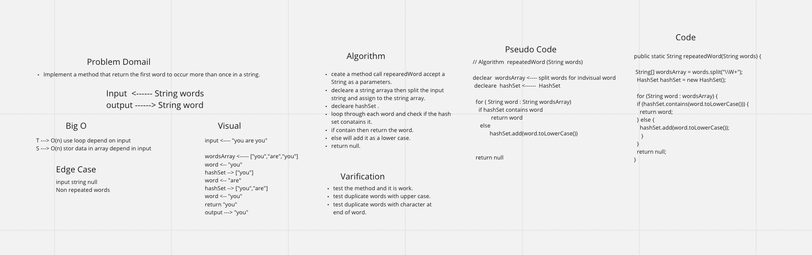

# Repeated Word with Hashtable

## Challenge
Write a function called repeated word that finds the first word to occur more than once in a string

Arguments: string

Return: string

## Approach & Efficiency
T: O(n)
S: O(n)

## Solution
[Code](./app/src/main/java/hashmap/repeated/word/HashmapRepeatedWord.java) | [Tests](./app/src/test/java/hashmap/repeated/word/HashmapRepeatedWordTest.java)

## API

***repeatedWord()***: Accept method contain Arguments words returns word. this method
split words and loop through each word and check if the hashset contains word
if yes will return the word else will add to hashset.

