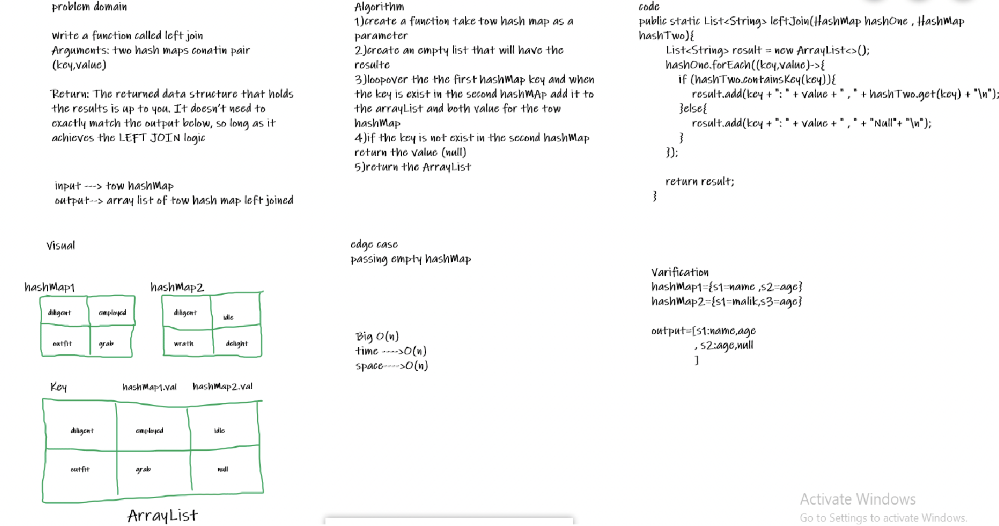

# Hash Table

## Challenge

Implement a Hashtable with the following methods:
* `add()`
1. Arguments: key, value
2. Returns: nothing
3. This method should hash the key, and add the key and value pair to the table, handling collisions as needed.
* `get()`
1. Arguments: key
2. Returns: Value associated with that key in the table

* `contains()`
1. Arguments: key
2. Returns: Boolean, indicating if the key exists in the table already.

* `hash()`
1. Arguments: key
2. Returns: Index in the collection for that key

## Solution
[Code](./app/src/main/java/hashtable/HashTable.java) | [Tests](./app/src/test/java/hashtable/HashTableTest.java)

## Approach & Efficiency

***add()*** S: O(n) T: O(1)

***get()*** S: O(n) T: O(1)

***contains()*** S: O(n) T: O(n)

***hash()*** S: O(1) T: O(1)

## API

* add() method contain Arguments key and value, returns nothing, this method should hash the key, and add the key and value pair to the table, handling collisions as needed.
* get() method contain Arguments key and returns Value associated with that key in the table.
* contains() method contain Arguments key and returns Boolean, indicating if the key exists in the table already.
* hash() method contain Arguments key and returns Index in the collection for that key.
* isEmpty() to check if the array is empty or not,Return Boolean

-------------------------------------------------------------

### Challenge 33
# Hashmap LEFT JOIN

Implement a simplified LEFT JOIN for two Hashmaps.

## Challenge

Write a function that LEFT JOINs two hashmaps into a single data structure.

## Approach & Efficiency

the big O notation of the function is :
time complexity = O(n)
space complexity = O(n)

## API
takes two hashMap as parameters, Looping over them and return  an array contain the matched key with the value of it.

## Solution

