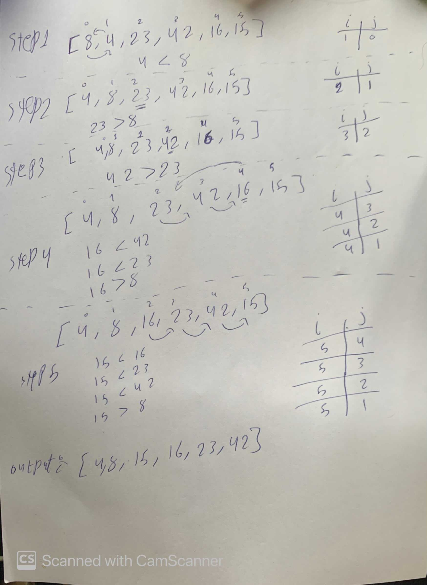

# Insertion Sort
Insertion sort is the sorting mechanism where the sorted array is built having one item at a time.
The array elements are compared with each other sequentially and then arranged simultaneously in some particular order.

## Pseudocode

```
 InsertionSort(int[] arr)

    FOR i = 1 to arr.length

      int j <-- i - 1
      int temp <-- arr[i]

      WHILE j >= 0 AND temp < arr[j]
        arr[j + 1] <-- arr[j]
        j <-- j - 1

      arr[j + 1] <-- temp
      
```
## Trace
Input: array {8,4,23,42,16,15}





* ## step1

 * Loop on the array starting from index number 1.
* start from the second element (index one ) that have the value 4
* Compare the value with all previous elements which in this step just 8
* Check 8 is grater than 4 then shift 8 one position to the right as shown in the pic above.
* There is no more elements to compare so insert the value 4 in the index 0.


## step 2

* The index i will become 2 which contain the value 23
* Compare the value with all previous elements which are 8 and 4
* 23 is grater than 8 no need for shift so keep the value in its position and go to the next iteration.


## step 3

* The index i will become 3 which contain the value 23
* Compare the value with all previous elements which are 23, 8, and 4.
* 42 is grater than 23 no need for shift so keep the value in its position and go to the next iteration.

* ## step 4
* The index i will become 4 which contain the value 16
* Compare the value with all previous elements which are 42, 23, 8, and 4.
* Check 42 is grater than 16 then shift 42 one position to the right as shown in the pic above.
* Check 23 is grater than 16 then shift 23 one position to the right as shown in the pic above.
* 16 is grater than 8 no need for shift so keep the value in its position and go to the next iteration.

* ## step 5 

* The index i will become 5 which contain the value 15
* Compare the value with all previous elements which are 42, 23, 16, 8, 4.
* Check 42 is grater than 15 then shift 42 one position to the right as shown in the pic above.
* Check 23 is grater than 15 then shift 23 one position to the right as shown in the pic above.
* Check 23 is grater than 15 then shift 15 one position to the right as shown in the pic above.
* 15 is grater than 8 no need for shift so keep the value in its position and go to the next iteration.
