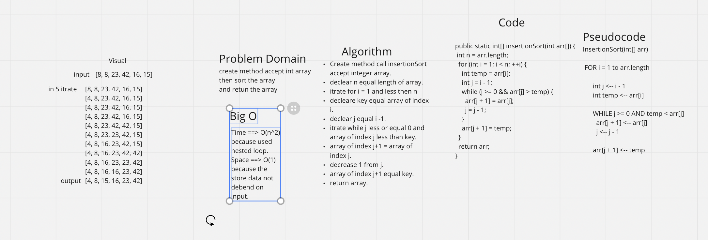

# Insertion Sort

# Challenge Summary
Insertion sort is a simple sorting algorithm that works the way we sort playing cards in our hands.

## Challenge Description
Create a method that accepts an array and performs insertion sort on the array. The goal is to sort in place rather 
than declaring another array to store and sort values.

## WhiteBoard

## Approach & Efficiency
Using in place method starting at index 1 and loop through to compare each index and swap the adjacent value if it is
 smaller than the current value. 

Time | Space
--- | ---
O(nlogn) | O(1)

