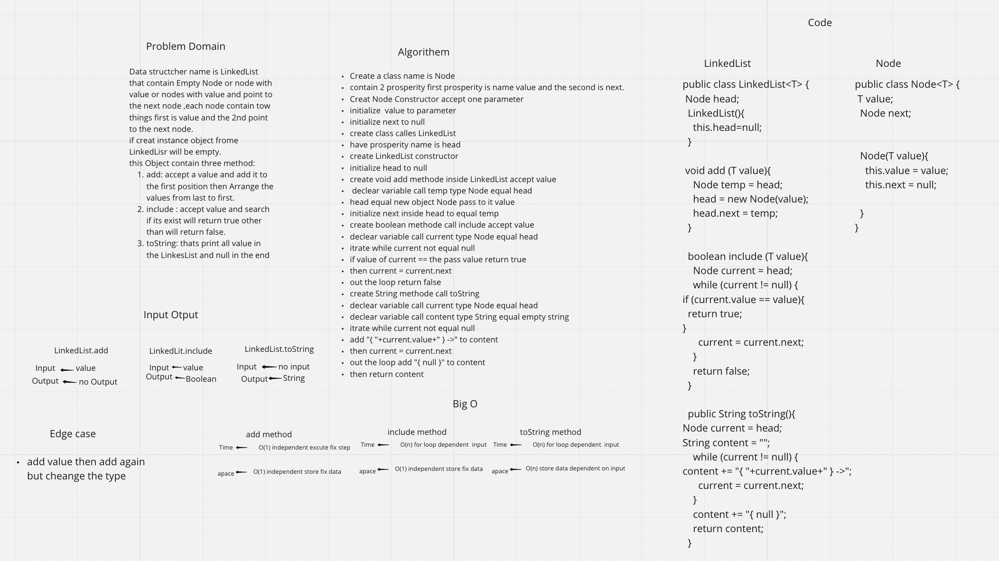

# Data Structures and Algorithms

## Language: `Java`

* ***LinkedList***

## Singly Linked List

**linked list is a linear collection of data elements whose order is not given by their physical placement in memory. Instead, each element points to the next. It is a data structure consisting of a collection of nodes which together represent a sequence.**

## Challenge
creat Linked List class that contain this method:
1. insert.
2. includes.
3. to string.

## Approach & Efficiency

* can creat instance empty linked list
* can add node to the empty linked list an the head will point to the firs node in linked list.
* can add multy node to the list and evry one will add to the head
* can find the value if is exist or not if is exist will return true else will return false
* insert method the Big O time & space is O(1).
* inclode method the Big O time is O(n) & space is O(1).
* toString method the Big O time is O(n) space is O(1).

## API
* insert : add new node to linled list in first position.
* include : accept value and check if it inside the linkedlist if yes return true if no return false.
* toString :Returns all the value at the linked list as string at this format : "{ a } -> { b } -> { c } -> NULL".

