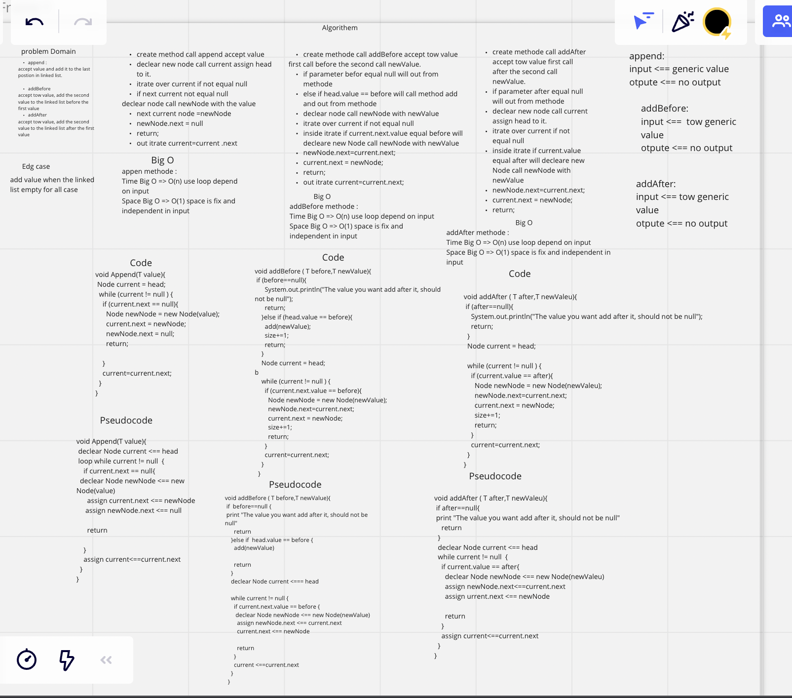

# Data Structures and Algorithms

## Language: `Java`

* ***LinkedList***

Singly Linked List
linked list is a linear collection of data elements whose order is not given by their physical placement in memory. Instead, each element points to the next. It is a data structure consisting of a collection of nodes which together represent a sequence.

Challenge
creat Linked List class that contain this method:

1. append.
2. addBefore.
3. addAfter

## Approach & Efficiency
can creat instance empty linked list
can add node to the empty linked list an the head will point to the last node in linked list.
can add multy node to the list and evry one will add to the last postion.

append methode :

Time Big O => O(n) use loop depend on input
Space Big O => O(1) space is fix and independent in input

addBefore methode :

Time Big O => O(n) use loop depend on input
Space Big O => O(1) space is fix and independent in input

addAfter methode :
Time Big O => O(n) use loop depend on input
Space Big O => O(1) space is fix and independent in input

## API
append : add new node to linled list in last position.
addAfter : accept tow value, add the second value to the linked list before the first value.
addAfter :accept tow value, add the second value to the linked list after the first value.
