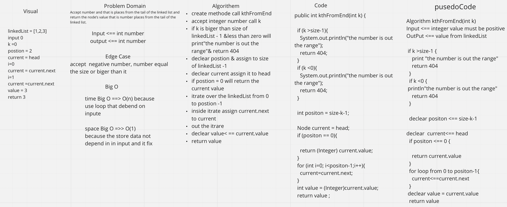

# Data Structures and Algorithms

## Language: `Java`

* ***LinkedList***

# LinkedList
Singly Linked List linked list is a linear collection of data elements whose order is not given by their physical placement in memory. Instead, each element points to the next. It is a data structure consisting of a collection of nodes which together represent a sequence.

## Challenge 

create kthFromEnd method.

## Approach & Efficiency

can get the value based in postion of the node from tail to head.

time Big O ==> O(n) because use loop that debend on inpute.

space Big O =>> O(1) because the store data not depend on input and it fix.

## Api 

kthFromEnd method: accept an integer number plase from tail to head of linked List and return value in this postion on linked list.

