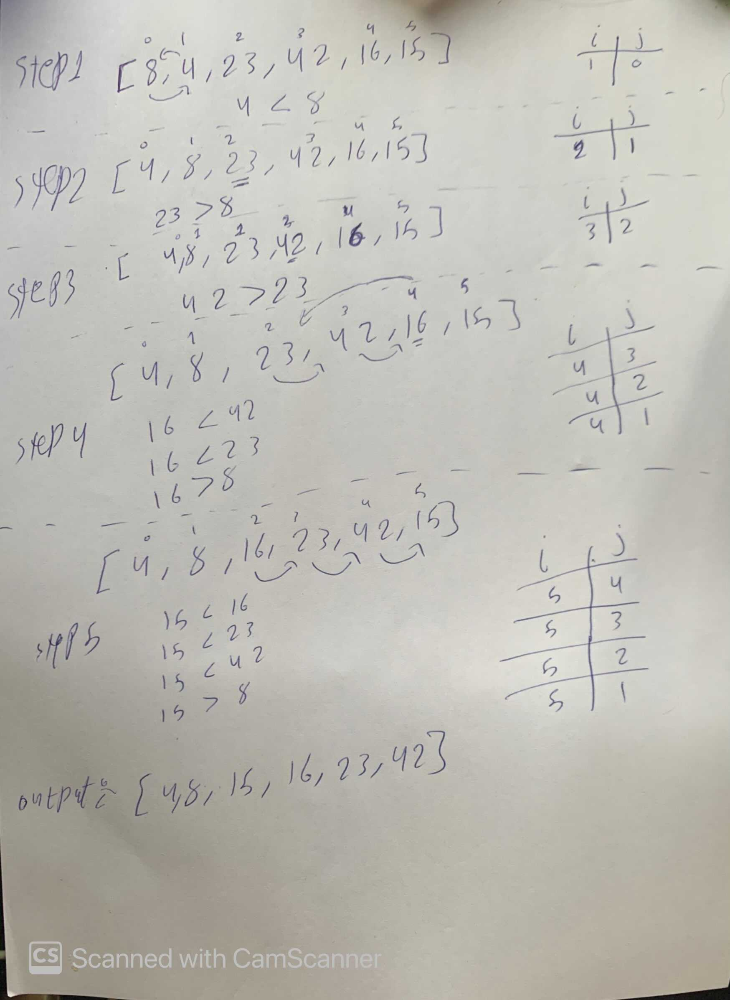

## Merge sort
Merge sort is one of the most efficient sorting algorithms. It works on the principle of Divide and Conquer.

## Pseudocode

```
 ALGORITHM Mergesort(arr)
    DECLARE n <-- arr.length

    if n > 1
      DECLARE mid <-- n/2
      DECLARE left <-- arr[0...mid]
      DECLARE right <-- arr[mid...n]
      // sort the left side
      Mergesort(left)
      // sort the right side
      Mergesort(right)
      // merge the sorted left and right sides together
      Merge(left, right, arr)

ALGORITHM Merge(left, right, arr)
    DECLARE i <-- 0
    DECLARE j <-- 0
    DECLARE k <-- 0

    while i < left.length && j < right.length
        if left[i] <= right[j]
            arr[k] <-- left[i]
            i <-- i + 1
        else
            arr[k] <-- right[j]
            j <-- j + 1

        k <-- k + 1

    if i = left.length
       set remaining entries in arr to remaining values in right
    else
       set remaining entries in arr to remaining values in left
      
```
## Trace
Input: array {8,4,23,42,16,15}

* first subarray is actually the full array, array[0..5].
* In the divide step, we compute mid equals 3.
* The conquer step by recursively has us sort the two subarrays array[0..2], which contains [8,4,23], and array[3..5], which contains [42,16,15] As shown in step 1 picture.
* When we come back from the conquer step, each of the two subarrays is sorted: array[0..2] contains [4,8,23] and array[3..5] contains [15,16,42] As shown in step 4 pic.
* Finally, the combine step merges the two sorted subarrays in the first half and the second half, producing the final sorted array [4,8,15,16,23,42].




