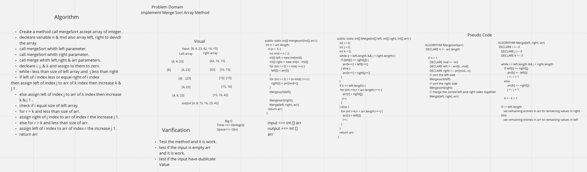

# Merge Sort

# Challenge Summary
Merge Sort is a Divide and Conquer algorithm. It divides input array in two halves, calls itself for the
two halves and then merges the two sorted halves.

## Challenge Description
Create a method that accepts an array and performs merge sort on the array.

## Approach & Efficiency
Using in place method starting at index 1 and loop through to compare each index and swap the adjacent value if it is
 smaller than the current value.

Time | Space
--- | ---
O(nlgn)) | O(n)

## Solution
[Code](./app/src/main/java/merge/sort/MergeSort.java) | [Test](./app/src/test/java/merge/sort/MergeSortTest.java) | [Blog](./Blog.md)

