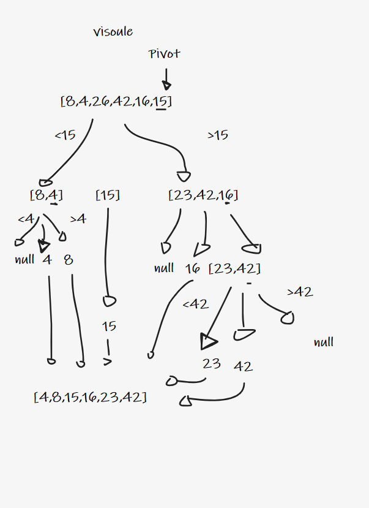

# Quick Sort

take an array then divid it .

quick sort its take one elemant and make it a pivot element then move all less elemnt to the left and all the highest elemat to the right and repit it until the array sorted

## Pseudocode

ALGORITHM QuickSort(arr, left, right)
    if left < right
        // Partition the array by setting the position of the pivot value
        DEFINE position <-- Partition(arr, left, right)
        // Sort the left
        QuickSort(arr, left, position - 1)
        // Sort the right
        QuickSort(arr, position + 1, right)

ALGORITHM Partition(arr, left, right)
    // set a pivot value as a point of reference
    DEFINE pivot <-- arr[right]
    // create a variable to track the largest index of numbers lower than the defined pivot
    DEFINE low <-- left - 1
    for i <- left to right do
        if arr[i] <= pivot
            low++
            Swap(arr, i, low)

     // place the value of the pivot location in the middle.
     // all numbers smaller than the pivot are on the left, larger on the right.
     Swap(arr, right, low + 1)
    // return the pivot index point
     return low + 1

ALGORITHM Swap(arr, i, low)
    DEFINE temp;
    temp <-- arr[i]
    arr[i] <-- arr[low]
    arr[low] <-- temp

## Trace
Array: [8,4,23,42,16,15]

Pass 1 :
take on element and make it as a pivot element 

pass 2 : 
divid the array into half and sort it for two groups less then pivot and highse then pivot 

pass 3 : 
do the same thing for the divided arrays 

pass 4 : 

repit it until i have a sorted array

