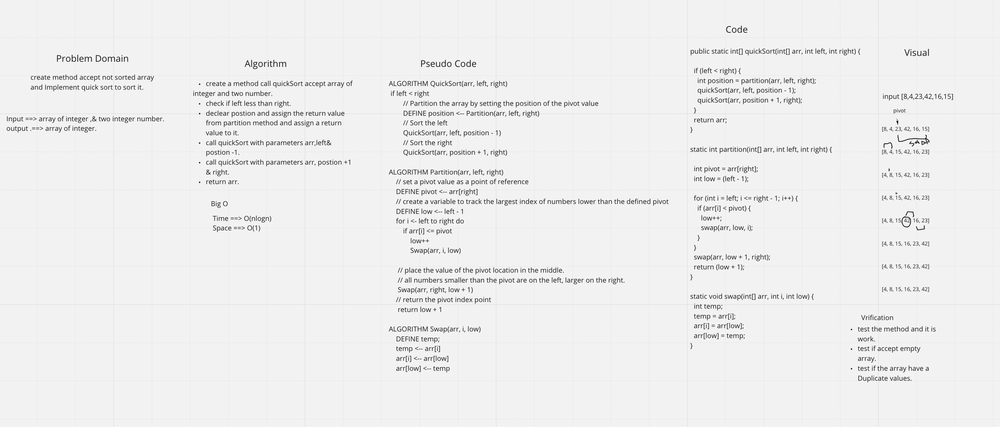

~~# Quick Sort

***Main Points***

Like Merge Sort, QuickSort is a Divide and Conquer algorithm. It picks an element as pivot and partitions the given array around the picked pivot. There are many different versions of quickSort that pick pivot in different ways.

# Challenge Summary
Quick sort is based on the divide-and-conquer approach based on the idea of choosing one element as a pivot element and partitioning the array around it such that: Left side of pivot contains all the elements that are less than the pivot element Right side contains all elements greater than the pivot

## Challenge Description
Create a method that accepts an array and performs quick sort on the array.

## Approach & Efficiency

Time | Space
--- | ---
O(nlogn)) | O(1)

## Solution
[Code](./app/src/main/java/quick/sort/QuickSort.java) | [Tests](./app/src/test/java/quick/sort/AppTest.java)

