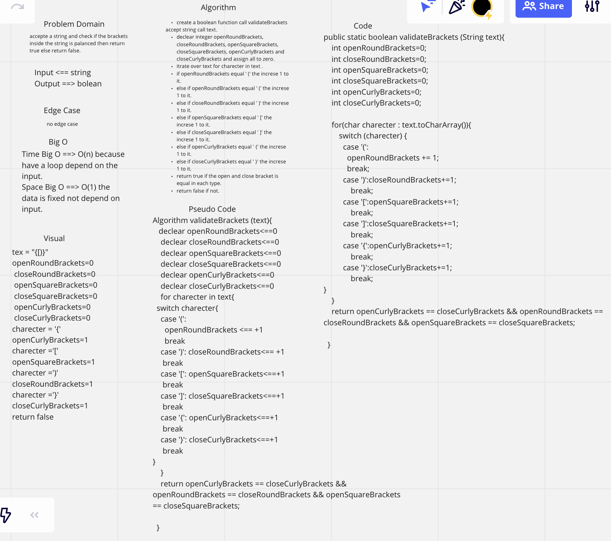

# Bracket

epresenting whether or not the brackets in the string are balanced.

## Challenge

create a function accept a string and return true if the brackets in the string are balanced
and return false if is not balanced.

### Bracket class
**Method**
1. validateBrackets.

## Approach & Efficiency

method is statec can access it direct from class. can check if the brackets are balanced in string.
Big O time is O(n) and for the space is (1).

## API
validateBrackets: check if the string have a balanced brackets or not
retun true if balanced and false if not.
push : add value to last postion in stack.

