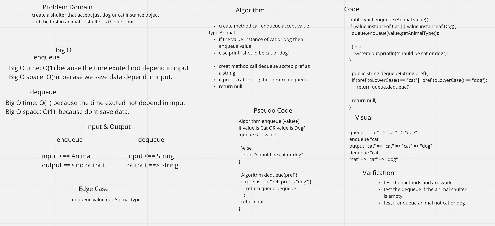
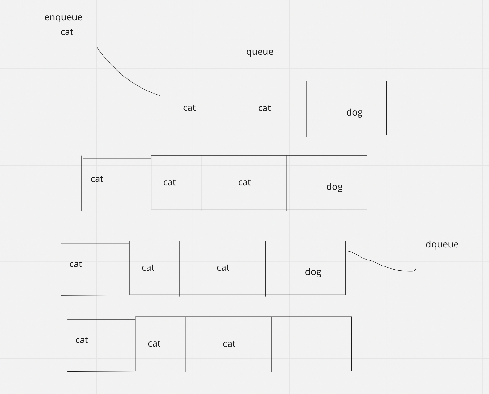

# Animal Shulter

***Accept just Animal Instance of Cat or Dog.***

***use Queue for storage the animal(FIFO).***
## Challenge

create AnimalShulter class have to method that accept Animal but should be
instance of cat or dog to enqueue or dqeueue if the string is cat or dog.

## WhiteBoard

## visua in detail

### AnimalShulter Class

1.**enqueue**
2. **dequeue**
3. **lastAnimalIn**

### Animal Class
**prosperity**
1. animalType
2. name
## Cat Class extend Animal
**prosperity**

* name
## Dog Class extend Animal

* name

## Approach & Efficiency

can create instance empty object in each class. if dequeue and the queue is empty will return the queue is emmpty.
can push multi value.

enqueue Big O time O(1) & space O(n).

Big O time O(1) & space O(1).

## API
enqueue: add Animal to the rear of the queue.
dequeue: remove first Animal enqueue to the queue.
lastAnimalIn: return the rear value in the queue

