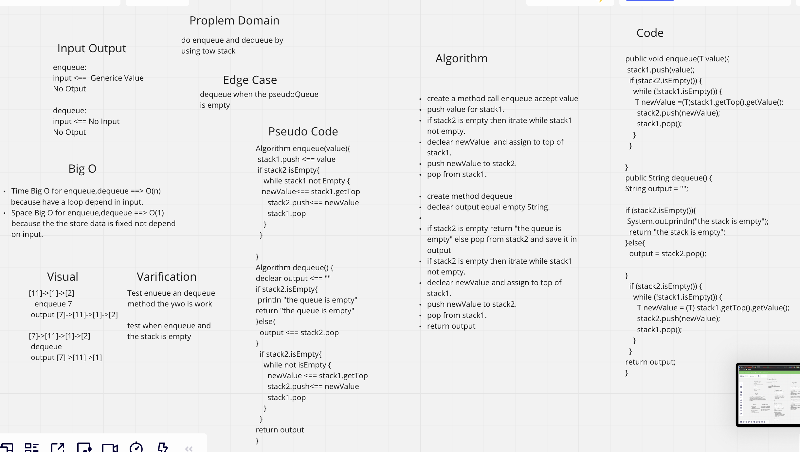

# stack-queue-pseudo

do enqueue and dequeue like queue by using a two stack.

## Challenge

do enqueue & queue bu using two stack.

1. enqueue
2. dequeue

## White Board

## Approach & Efficiency

can create instance empty object.
can push multi value.
Big O time O(n) & space big O(1).

## API

dequeue : add value to First postion in stack.
dequeue : remove the first value insid queue.

