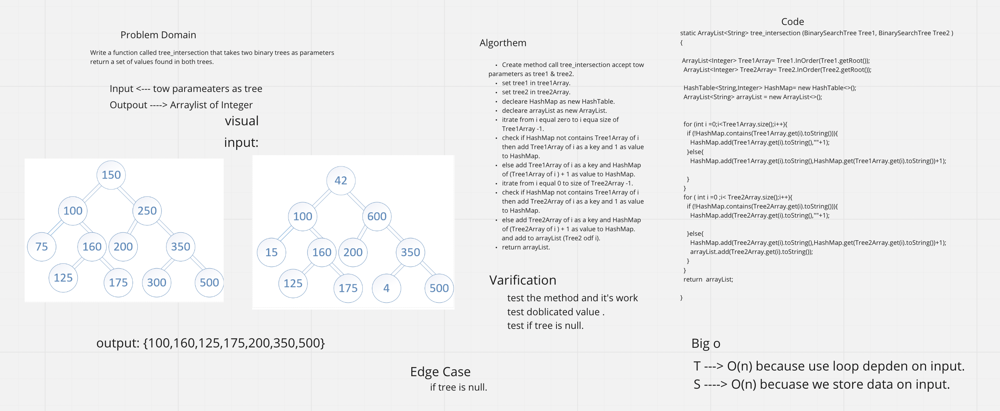

# Tree Intersection

## Challenge
Write a function called tree_intersection that takes two binary tree parameters.

## Approach & Efficiency
Create a tree intersection method that accepts both binary trees and compares each value in both trees.
First, using binary trees InOrder to add them to the list.
Then check for HashMap contains the value in Tree1Array and add it if not
then check for HashMap contains the value in Tree2Array contains the same value as HashMap and add to arrayList.

Time | Space
--- | ---
O(n) | O(n)

## Solution
[Code](./app/src/main/java/tree/intersection/HashTable.java) | [Tests](./app/src/test/java/tree/intersection/HashTableTest.java)

