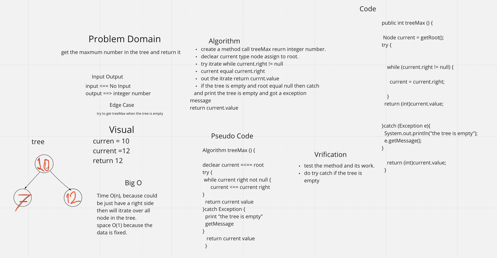
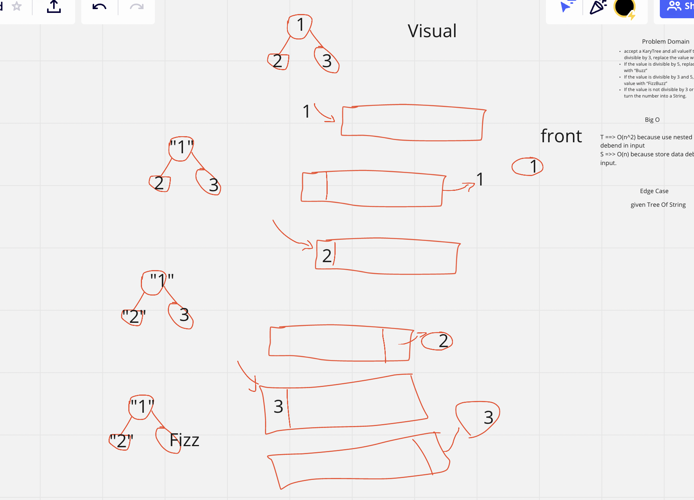

# Trees

***data structure can be defined recursively as a collection of nodes, where each node is a data structure consisting of a value and a list of references to nodes. The start of the tree is the "root node" and the reference nodes are the "children". No reference is duplicated and none points to the root.***

## Challenge

**get all value in the tree by breadth first (all element raw by raw from first element in the lift to last element in the right in eash raw in the tree)**

## WhiteBoard

## Approach & Efficiency

can get all element in the tree.
get all element raw by raw frome left to right
Time Big O is O(n)
Space Big O is O(n)

## Challenge

***create method that return the maximum number in the tree.***

## WhiteBoard

## API
breadthFirst:  input is Node Type Should be root in the tee. return integer ArrayList get the all element in tree presented in breadth first.

## Approach & Efficiency
can fet the maximum number even if the tree have just a root.
have an Exception if the tree is empty
Time Big O is O(n).
Space Big O is O(1).

## API
maxTree: no input return integer number represent the maximum number in the tree.

## Challenge

***create method that replace each node value in the KaryTree if divisible by 3, replace the value with “Fizz”
 If the value is divisible by 5, replace the value with “Buzz”
 If the value is divisible by 3 and 5, replace the value with “FizzBuzz”
If the value is not divisible by 3 or 5, simply turn the number into a String.***

## WhiteBoard

### vizual

## API
fizzBuzz:  Tree, return Tree as string  get the all element in tree replace the value with fizz, Buzz, FizzBuzz based in the condition
 if not able in condition return the number as a string and return tree in the same sequence.

## Approach & Efficiency
replace all value without change the structure. keep all node in the same postion.

have an Exception if the tree is empty
Time Big O is O(n^2).
Space Big O is O(n).

## API
maxTree: input Tree  output is Tree evry node with string value and the same postion.

